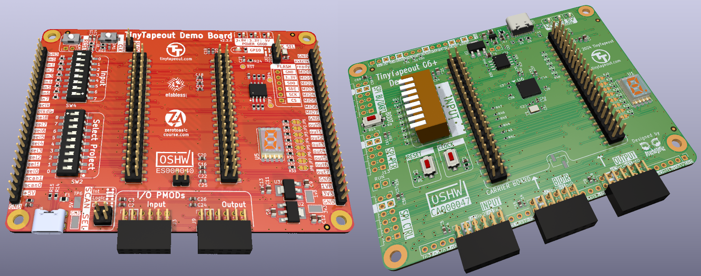

# Tiny Tapeout PCB Production Files

The [Tiny Tapeout](https://tinytapeout.com/) [demo board](https://github.com/TinyTapeout/tt-demo-pcb) and ASIC/FPGA [breakout boards](https://github.com/tinyTapeout/breakout-pcb) are open source and contain all the information required to produce the generated files used during production and assembly (gerbers, BOM, placement positions files).

This, however, requires having [KiCad](https://kicad.org) running, checking out the correct tag or version of the project, and then more work to export the data.  Plus, it's difficult to be certain whether what you are looking at is what was actually produced.

So this repository is aimed at preserving archives of the PCB/PCBA production files as they were used when creating the relevant run.  

